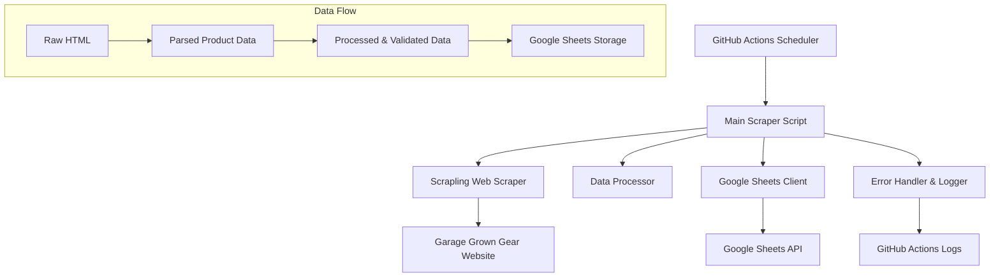

# Design Document

## Overview

The Garage Grown Gear scraper is designed as a modular Python application that leverages Scrapling for robust web scraping, Google Sheets API for data storage, and GitHub Actions for automated execution. The system follows a clean architecture pattern with separate concerns for scraping, data processing, storage, and orchestration.

## Architecture



The system uses a pipeline architecture where data flows through distinct stages:
1. **Extraction**: Scrapling fetches and parses HTML content
2. **Transformation**: Raw data is cleaned, validated, and structured
3. **Loading**: Processed data is written to Google Sheets
4. **Monitoring**: Comprehensive logging and error handling throughout

## Components and Interfaces

### 1. Web Scraper Module (`scraper.py`)

**Purpose**: Handles all web scraping operations using Scrapling

**Key Classes**:
- `GarageGrownGearScraper`: Main scraper class
- `ProductExtractor`: Extracts individual product data
- `PaginationHandler`: Manages multi-page scraping

**Methods**:
```python
class GarageGrownGearScraper:
    def __init__(self, base_url: str, use_stealth: bool = True)
    def scrape_all_products(self) -> List[Dict[str, Any]]
    def scrape_page(self, page_url: str) -> List[Dict[str, Any]]
    def extract_product_data(self, product_element) -> Dict[str, Any]
    def handle_pagination(self) -> List[str]
```

**Scrapling Configuration**:
- Uses `Fetcher` class for basic HTTP requests with stealth headers
- Implements retry logic with exponential backoff
- Handles rate limiting and respectful crawling delays
- Uses CSS selectors optimized for the site's structure

### 2. Data Processing Module (`data_processor.py`)

**Purpose**: Validates, cleans, and structures scraped data

**Key Classes**:
- `ProductDataProcessor`: Main data processing logic
- `PriceParser`: Handles price string parsing and validation
- `DataValidator`: Ensures data quality and completeness

**Methods**:
```python
class ProductDataProcessor:
    def process_products(self, raw_products: List[Dict]) -> List[Dict]
    def clean_product_data(self, product: Dict) -> Dict
    def calculate_discount_percentage(self, current_price: float, original_price: float) -> float
    def validate_product_data(self, product: Dict) -> bool
```

### 3. Google Sheets Client (`sheets_client.py`)

**Purpose**: Manages all Google Sheets operations

**Key Classes**:
- `SheetsClient`: Main Google Sheets interface
- `SheetFormatter`: Handles data formatting for sheets
- `CredentialsManager`: Manages authentication

**Methods**:
```python
class SheetsClient:
    def __init__(self, credentials_path: str, spreadsheet_id: str)
    def authenticate(self) -> None
    def create_sheet_if_not_exists(self, sheet_name: str) -> None
    def append_data(self, sheet_name: str, data: List[List]) -> None
    def format_sheet(self, sheet_name: str) -> None
```

### 4. Configuration Manager (`config.py`)

**Purpose**: Centralizes all configuration settings

**Configuration Structure**:
```python
@dataclass
class ScraperConfig:
    base_url: str = "https://www.garagegrowngear.com/collections/sale-1"
    max_retries: int = 3
    retry_delay: float = 1.0
    request_timeout: int = 30
    use_stealth_mode: bool = True
    
@dataclass
class SheetsConfig:
    spreadsheet_id: str
    sheet_name: str = "Product_Data"
    credentials_file: str = "service_account.json"
    
@dataclass
class LoggingConfig:
    level: str = "INFO"
    format: str = "%(asctime)s - %(name)s - %(levelname)s - %(message)s"
```

### 5. Error Handling & Logging (`error_handler.py`)

**Purpose**: Comprehensive error handling and logging system

**Key Features**:
- Structured logging with different levels
- Error categorization and handling strategies
- Performance monitoring and metrics collection
- Integration with GitHub Actions logging

## Data Models

### Product Data Schema

```python
@dataclass
class Product:
    timestamp: datetime
    name: str
    brand: str
    current_price: float
    original_price: Optional[float]
    discount_percentage: Optional[float]
    availability_status: str  # "Available", "Sold out", "Limited"
    rating: Optional[float]
    reviews_count: Optional[int]
    product_url: str
    sale_label: Optional[str]  # "Save 40%", etc.
    image_url: Optional[str]
    
    def to_sheets_row(self) -> List[str]:
        """Convert product data to Google Sheets row format"""
        pass
```

### CSS Selectors Configuration

Based on the provided HTML structure:
```python
SELECTORS = {
    'product_items': '.product-item',
    'product_name': '.product-item__title',
    'brand': '.product-item__vendor',
    'current_price': '.price--highlight [data-money-convertible]',
    'original_price': '.price--compare [data-money-convertible]',
    'sale_label': '.product-label--on-sale',
    'availability': '.product-item__inventory',
    'rating': '.stamped-badge[data-rating]',
    'reviews_count': '.stamped-badge-caption[data-reviews]',
    'product_link': '.product-item__title',
    'image': '.product-item__primary-image'
}
```

## Error Handling

### Error Categories and Strategies

1. **Network Errors**:
   - Connection timeouts: Retry with exponential backoff
   - HTTP errors (4xx, 5xx): Log and skip, continue with next items
   - Rate limiting: Implement respectful delays

2. **Parsing Errors**:
   - Missing elements: Use default values, log warnings
   - Invalid data formats: Skip item, log error details
   - Structure changes: Graceful degradation with notifications

3. **Google Sheets Errors**:
   - Authentication failures: Retry with fresh credentials
   - API quota exceeded: Implement backoff and retry later
   - Network issues: Cache data locally, retry on next run

4. **System Errors**:
   - Memory issues: Implement batch processing
   - Disk space: Clean up temporary files
   - Unexpected exceptions: Comprehensive logging and graceful shutdown

## Testing Strategy

### Unit Tests
- Individual component testing for each module
- Mock external dependencies (web requests, Google Sheets API)
- Test data validation and processing logic
- Error handling scenarios

### Integration Tests
- End-to-end scraping workflow
- Google Sheets integration with test spreadsheet
- GitHub Actions workflow validation

### Performance Tests
- Scraping speed benchmarks
- Memory usage monitoring
- API rate limit compliance

### Monitoring and Alerting
- Success/failure metrics tracking
- Performance degradation detection
- Data quality monitoring (missing fields, invalid formats)

## Security Considerations

1. **Credentials Management**:
   - Google Sheets service account keys stored in GitHub Secrets
   - No hardcoded credentials in source code
   - Principle of least privilege for API access

2. **Web Scraping Ethics**:
   - Respectful crawling with appropriate delays
   - User-Agent identification
   - Compliance with robots.txt
   - Rate limiting to avoid server overload

3. **Data Privacy**:
   - Only collect publicly available product information
   - No personal data collection
   - Secure transmission of data to Google Sheets

## Deployment Architecture

### GitHub Actions Workflow
```yaml
name: Garage Grown Gear Scraper
on:
  schedule:
    - cron: '0 */6 * * *'  # Every 6 hours
  workflow_dispatch:  # Manual trigger

jobs:
  scrape:
    runs-on: ubuntu-latest
    steps:
      - uses: actions/checkout@v3
      - name: Set up Python
        uses: actions/setup-python@v4
        with:
          python-version: '3.11'
      - name: Install dependencies
        run: |
          pip install -r requirements.txt
      - name: Run scraper
        env:
          GOOGLE_SHEETS_CREDENTIALS: ${{ secrets.GOOGLE_SHEETS_CREDENTIALS }}
          SPREADSHEET_ID: ${{ secrets.SPREADSHEET_ID }}
        run: python main.py
```

### Environment Variables
- `GOOGLE_SHEETS_CREDENTIALS`: Base64 encoded service account JSON
- `SPREADSHEET_ID`: Target Google Sheets document ID
- `SCRAPER_CONFIG`: Optional JSON configuration overrides

## Performance Optimization

1. **Efficient Scraping**:
   - Concurrent processing where appropriate
   - Minimal DOM parsing with targeted selectors
   - Request caching for repeated operations

2. **Memory Management**:
   - Streaming data processing for large datasets
   - Garbage collection optimization
   - Batch processing for Google Sheets writes

3. **Network Optimization**:
   - Connection pooling and reuse
   - Compression support
   - Optimal timeout configurations

This design provides a robust, maintainable, and scalable solution for monitoring the Garage Grown Gear sale page while respecting web scraping best practices and ensuring reliable data collection.